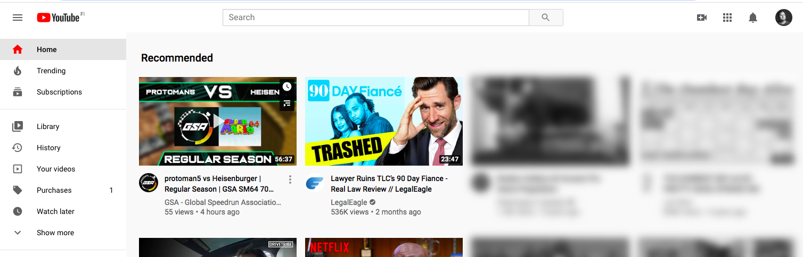

# Blur old Youtube recommendations

Youtube's recommendation system is wacky. Sometimes, it brings up old recommendations from years ago and I get excited about them being new. I built this small extension for myself to hide them so I can focus on newer items.

## How does it work?

On Youtube front page, where you see the list of recommendations, if you click the extension icon, it will grayscale and blur all items with timestamp of 1 year or older. It's bit crude but it helps my focus not wandering into them.



## How to use?

It's currently an unpacked extension so clone this repository with

```
git clone git@github.com:Hamatti/blur-old-youtube-videos.git
```

then open your Google Chrome, go to [chrome://extensions](chrome://extensions), enable Developer mode from the toggle and select "Load unpacked" and navigate to this folder.

## LICENSE

Copyright 2020 Juha-Matti Santala

Permission is hereby granted, free of charge, to any person obtaining a copy of this software and associated documentation files (the "Software"), to deal in the Software without restriction, including without limitation the rights to use, copy, modify, merge, publish, distribute, sublicense, and/or sell copies of the Software, and to permit persons to whom the Software is furnished to do so, subject to the following conditions:

The above copyright notice and this permission notice shall be included in all copies or substantial portions of the Software.

THE SOFTWARE IS PROVIDED "AS IS", WITHOUT WARRANTY OF ANY KIND, EXPRESS OR IMPLIED, INCLUDING BUT NOT LIMITED TO THE WARRANTIES OF MERCHANTABILITY, FITNESS FOR A PARTICULAR PURPOSE AND NONINFRINGEMENT. IN NO EVENT SHALL THE AUTHORS OR COPYRIGHT HOLDERS BE LIABLE FOR ANY CLAIM, DAMAGES OR OTHER LIABILITY, WHETHER IN AN ACTION OF CONTRACT, TORT OR OTHERWISE, ARISING FROM, OUT OF OR IN CONNECTION WITH THE SOFTWARE OR THE USE OR OTHER DEALINGS IN THE SOFTWARE.
